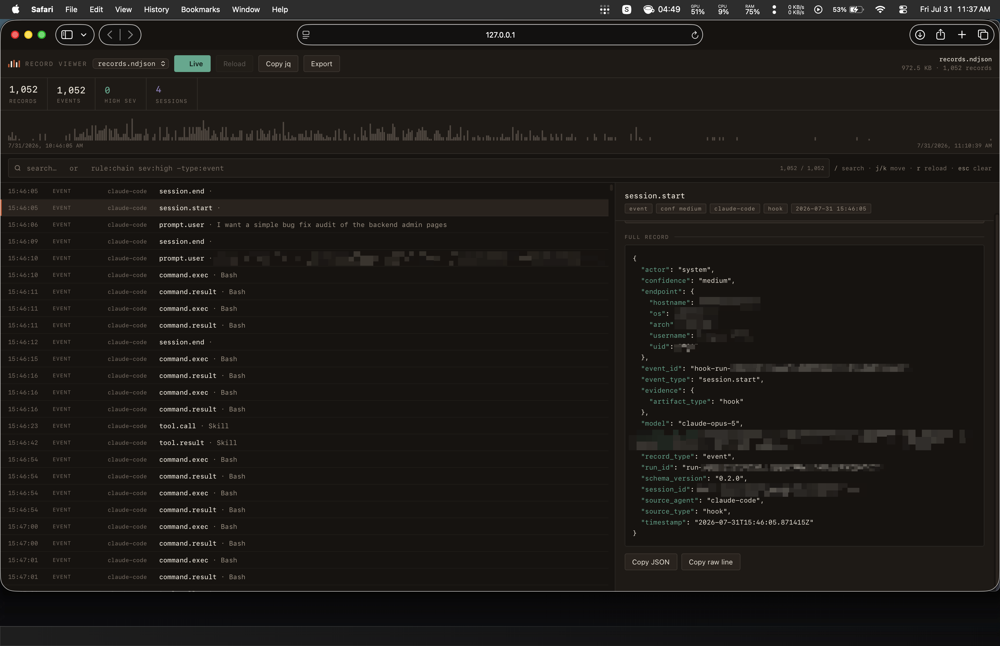

# Termitarium

A local viewer, a hardened localhost server, and a retention tool for
[numbat](https://github.com/perplexityai/numbat) record streams.

numbat writes NDJSON. It does not ship a UI. This fills that gap without
sending anything anywhere.

> Not affiliated with or endorsed by Perplexity AI. "numbat" is their project;
> this is an independent companion toolkit that reads its output format.

**Tested against numbat v0.1.1, record schema 0.2.0.** The schema is young and
will move; check \`CHANGELOG.md\` for the version this tracks.



---

## What's here

| | |
|---|---|
| `viewer/viewer.html` | Single-file record viewer: plain-language descriptions, per-event explanation, per-finding interpretation, session rollups, virtual scrolling, query language, timeline scrubbing, cited-event resolution in both directions |
| `numbatd/main.go` | ~190-line Go server: serves the viewer and its icon from `-tools`, and whitelisted `*.ndjson` from `-dir`, over loopback only |
| `numbatd/go.mod` | Module definition — Go 1.16+ refuses to build outside a module, so the tree cannot be built without it |
| `prune/numbat-prune` | Retention tool: archive-before-delete, atomic replace, never loses a record |
| `install.sh` | Per-user install, builds the binary, wires launchd |
| `tools/gen-rule-catalog.js` | Maintainer tool: regenerates the viewer's embedded rule catalog from numbat's rule YAML. Never needed at runtime |
| `tools/gen-favicon.py` | Maintainer tool: regenerates `viewer/favicon.png` from the same geometry as the SVG |
| `test/viewer-logic.js` | Unit tests for the viewer's description, explanation, interpretation and session-rollup logic — `node test/viewer-logic.js`, no dependencies |
| `test/install-logic.sh` | Tests for `install.sh`: legacy migration, idempotency, uninstall — `bash test/install-logic.sh` |

## Install

```sh
git clone https://github.com/RKucher1/termitarium
cd termitarium
./install.sh
open http://127.0.0.1:8787/
```

Requires Go (to build the daemon) and Python 3 (`prune/numbat-prune` is a
Python script). Everything installs under `$HOME`. No sudo.
`./install.sh --uninstall` reverses it and leaves your records alone.

## Use

The daemon starts at login and serves the viewer at
**<http://127.0.0.1:8787/>** — that URL is all you need.

`nb` is a convenience wrapper and it is **fish-only**. `install.sh` writes it
to `~/.config/fish/functions/nb.fish` and skips it entirely when there is no
`~/.config/fish`, so on bash or zsh the command will not exist. Use the
right-hand column instead.

| fish | any shell |
|---|---|
| `nb` / `nb view` | `open http://127.0.0.1:8787/` |
| `nb status` | `curl -s http://127.0.0.1:8787/api/sources` |
| `nb start` | `launchctl load ~/Library/LaunchAgents/com.siliconhills.numbatd.plist` |
| `nb stop` | `launchctl unload ~/Library/LaunchAgents/com.siliconhills.numbatd.plist` |
| `nb prune -n` | `~/.numbat/bin/numbat-prune -n` |
| `nb prune` | `~/.numbat/bin/numbat-prune` |
| `nb logs` | `tail -n 30 ~/.numbat/numbatd.log` |

## Viewer

Opened at `http://127.0.0.1:8787/`, it asks the daemon for the source list,
loads your primary record file automatically — no file picker — and starts
streaming it live.

- **Descriptions** — every record renders as a plain sentence (`Proposed a
  shell command: npm test`, `Blocked an action: net.egress.block`) with its
  event type kept alongside as secondary context. The raw JSON stays one click
  away in the detail pane. Descriptions state only what the record contains: a
  `command.result` with no `exit_code` reports its duration rather than
  claiming success, and a `command.exec` says *proposed* rather than *ran*
  because on the hook path numbat sees the command before it executes — whether
  it ran is `command.result`'s business, and the two are not always paired.
  The same applies to files: numbat emits `file.read`/`file.write` from the
  pre-tool hook, and in every pair in the reference corpus the file event
  precedes its result, so the row says *asked to write* rather than *wrote*.
  Boundary events say *subagent started* when they carry a `sub_agent`, because
  107 of the 127 in the reference corpus are a subagent's, not the session's.
  A record tagged `tool_error` is marked in the row itself — it is the only
  failure signal these records carry, and it used to be reachable only by
  opening each record in turn.
- **Sort order** — newest first by default; toggle with the button in the query
  bar or `s`. Records with no parseable timestamp always sort to the bottom, in
  file order, in both directions. The timeline stays chronological regardless.
- **Local time everywhere** — numbat writes UTC; the viewer renders every time
  in your timezone, so rows, the timeline axis, and range pills all agree. The
  detail pane labels its timestamp with the zone, and the untouched UTC value
  is always visible in the raw JSON.
- **Query language** — `rule:chain sev:high agent:claude-code`, with `-` to
  negate. Fields: `rule` `sev` `agent` `type` `event` `session` `id`. Anything
  unprefixed is free text over the raw line *and* the description.
- **Timeline** — density plot with findings overlaid; drag to filter to a time
  window.
- **Cited events, both ways** — findings resolve `cited_event_ids` into jump
  buttons, so a sequence match is two clicks from the commands behind it; and
  the events themselves carry the reverse link, so an action that triggered a
  finding says so instead of leaving that fact visible only from the finding.
- **Session rollup** — narrow the view to one session and the detail pane
  summarizes it instead of showing the placeholder. Findings come first, each
  with its title, severity, and the file or command it fired on; then commands
  proposed against results observed, distinct files read and written, tool
  activity, enforcement decisions, subagent activity, and the prompt that
  started it. Every count that can name its records is a button that filters to
  them, so a finding count is a step rather than a full stop.
  **⧉ Browse sessions** lists every session in the file — agent, span, commands
  proposed, findings, lifecycle, and its opening prompt — and clicking one
  isolates it. Rollups are computed on demand and cached, never for every
  session up front. Selecting a record inside an isolated session does not
  discard the summary: the pane header keeps a labelled way back to it, so
  reading one command does not cost you the session you were reading it in.

  What it will not tell you is whether the session *succeeded*. numbat's schema
  defines an optional `exit_code`, but no record in the reference corpus
  carries one, so a `command.result` reports a duration and nothing else.
  Rather than invent a verdict the rollup reports what was proposed and what
  was observed, names the gaps, and leaves the judgement to you. A command with
  no matching result is reported as *no result was recorded* — never as a
  failure. The one real failure signal is the `tool_error` tag; on the hook path
  these records come from, numbat sets it only from a field the agent itself
  used to mark failure. (Records arriving over OTLP can also earn it from log
  severity, which is a weaker signal.) The rollup counts the tag and states
  plainly that its absence on the others is not evidence they succeeded.
  Nothing in the pane is green, because nothing in it can certify that a
  session was clean.

  Session boundaries are counted rather than collapsed to a flag, because they
  are not unique. numbat maps `SubagentStart`/`SubagentStop` onto
  `session.start`/`session.end` and copies `session_id` straight from the
  agent, so every parallel dispatch adds a boundary pair to its *parent*
  session — one real session in the reference corpus carries 29 `session.start`
  and 36 `session.end` records, of which one start and no ends are its own.
  Only boundaries with no `sub_agent` speak to whether the session ended, and
  the state is named after the record (`session.end recorded`) rather than
  given a verdict word like "ended".
- **Live** — **on by default.** A source served over loopback can be polled, so
  the viewer streams it without you reaching for a toggle; a file opened from
  disk has no URL to poll and stays static. Polls with HEAD requests and
  re-downloads only on change. Filters, time range, and selection survive each
  refresh. New records arrive at the top under the default sort and flash green.
  The indicator dot reads out what each poll found: grey for off, green for
  nothing new (with the last check time), amber for `+N` arrived, red for
  unreachable. Turning it off with `l` sticks — it will not re-arm itself.
- **Copy jq** — translates the current filter state into an equivalent `jq`
  command for scripting.

Keys: `/` search · `j`/`k` (or `↑`/`↓`) move · `g`/`G` ends · `s` sort ·
`r` reload · `l` live · `o` open a file · `esc` clear.

Virtualized rendering, chunked parsing, and a cached lowercase index per record
keep it responsive on large files. All output is HTML-escaped — agent command
text is untrusted input.

The description and interpretation logic is pure and unit-tested, and the
installer has its own suite:

```sh
node test/viewer-logic.js     # viewer logic
bash test/install-logic.sh   # install, migration, uninstall
```

The installer tests run against a sandbox `HOME` **and** override the launchd
labels, because `launchctl` is not scoped by `HOME` — without fake labels a
test running `--uninstall` would unload the agents on the developer's own
machine.

### Per-event explanation

Findings are the rare record. Events are 6,715 of the 6,839 in the reference
corpus, and selecting one shows the same four-part treatment a finding gets:
what this is, what happened next, any findings that cite it, and what the
record does and does not establish. Like the finding interpretation it is
computed locally and deterministically — no model call, no network.

A finding explains itself from its own fields and the embedded rule catalog. An
event has neither, so most of what an event means comes from the records beside
it. Two joins carry that weight, and both are built once when the file is
parsed rather than rediscovered per record.

**Its result.** `tool_call_id` pairs a call with its result in four shapes, not
the two the schema reading suggests: `command.exec`→`command.result`,
`file.write`→`tool.result`, `file.read`→`tool.result`, and
`tool.call`→`tool.result`. A `tool.result` usually answers a *file* event, not
a `tool.call`. Where a pair exists the pane reports the duration the result
carries; where one does not, it says so — *no result was recorded* — and states
in the same breath that this shows neither failure nor execution. In the
reference corpus 13 of 1,973 proposed commands have no result, and 12 of those
13 are mid-session, so a missing result is not a truncated file.

**Findings that cite it.** `cited_event_ids` only runs finding→event in the
file. The viewer builds the reverse index, so an event can say *this action
triggered a finding*, name the rule, and link to it — the mirror of the jump
buttons a finding already offers. Nothing assumes the relation is one-to-one,
though it happens to be in this corpus.

Where a pair is found, the paired record is a jump button, not just a sentence
about a record you then have to go and find.

The same refusal to imply success applies here as everywhere else. No record in
the reference corpus carries an `exit_code` at all, so a result reports its
duration and the pane says plainly that whether the command succeeded is not
recorded. The one real failure signal is the `tool_error` tag, and it is
attributed to the agent that set it rather than presented as a verdict — and on
a telemetry-sourced record, where the tag can come from log severity instead,
the weaker wording is used.

Three absences are kept distinct, because collapsing them would be a lie in a
forensic tool: a record with no `tool_call_id` *cannot* be matched; a record
whose `tool_call_id` this viewer declines to index is a limit of the viewer,
not an absence from the file; and a record whose counterpart genuinely is not
present is the only one reported as missing. Where several records share one
key the pane declines to name any of them rather than guessing, and where more
share it than the index holds, it says the one it named may be the wrong one.

Join keys are matched exactly and refused if they carry whitespace or a control
character — normalising them would let `abc` and `abc ` pair, so forging a
pairing would cost one trailing space. Record content never authors a sentence:
`sub_agent` is inlined only when it is identifier-shaped, because it becomes the
subject of the headline.

What the section does **not** carry is a definition of `confidence`. It is a
property of the field, not of the record, and it does not vary — every event in
the reference corpus is `medium`. As the last bullet on every pane it was a
quarter of all the text here, and a constant in the position where the rare
real caveat lives teaches the eye to skip the section. The value is still on
screen as a header tag.

Ordering claims are made only where the corpus supports them. In all 3,228
pairs the call side precedes the result side, without exception, which is why a
`file.write` is reported as a *requested* write rather than a completed one —
the same correction `command.exec` already received. Every bullet in the
closing section is gated on a field that is actually present; where a field is
missing the line is omitted rather than guessed.

### Per-finding interpretation

Selecting a finding shows an interpretation derived from that record, not a
fixed paragraph. It answers four questions: what the rule looks for, what it
saw here, why it fired, and what the record does and does not establish.

It is computed locally and deterministically — no model call, no network. The
rule text comes from a catalog embedded in the viewer: a finding carries its
rule's `title`, but not the `description` that explains what the rule actually
looks for, so that has to be shipped with the viewer.

The interpretation states only what the record supports. A finding whose
`observed_event_type` is `command.exec` under a live hook was seen *before* it
ran, so it says the record does not show whether it executed; a `file.write`
arrives from both the pre- and post-tool hook, so it claims no ordering at all;
an at-rest `artifact` finding says it was reconstructed after the fact. Where a
field is missing, the line is omitted rather than guessed.

Two fields are easy to over-read, and the interpretation is careful with both.
`confidence` grades how directly evidence backs the *observation* — a hook is
the agent's own report rather than a durable artifact, which is why hook events
are capped at `medium`. It is not uncertainty about the match (rule evaluation
is exact) and not a probability of harm. `observed_actor` is a classification
numbat applies by construction, not something it measures, so `assistant` means
the agent issued the tool call — the operator may still have asked for it.

Records carry `rule_version`. When it disagrees with the embedded catalog the
description is still shown but marked, so a numbat upgrade degrades visibly
instead of silently. The marker does not claim the text is merely *older*: a
`--rules-dir` rule replaces a shipped rule by id, so the catalog may be
describing a different rule rather than an earlier version of the same one.

To regenerate the catalog after a numbat upgrade:

```sh
node tools/gen-rule-catalog.js --rules-dir /path/to/numbat/rules
```

That rewrites a marked block in `viewer.html` and records the numbat commit it
read. It is a maintainer tool — the viewer remains a single self-contained file
with no build step, and nothing in `tools/` is needed to use it.

Rule titles and descriptions embedded in the viewer are © the numbat authors,
used under the Apache License 2.0.

## Security posture

The threat model for a localhost service is *other processes on the machine and
hostile pages in your browser*. The bullets below cover hostile pages, and they
bound what a local process can reach — but nothing here identifies a local
caller. See the last bullet before running this on a machine you share.

- **Loopback only.** Refuses at startup to bind anything whose host isn't
  `127.0.0.1`, `localhost`, or `::1`. `localhost` is a name your resolver
  controls, so this is a guardrail rather than a sandbox.
- **Host-header validation.** Requests whose `Host` is not a loopback name get
  403. This closes DNS rebinding — the one practical way a remote site reaches
  a localhost service.
- **No CORS headers, ever.** A malicious page can send a request to 127.0.0.1
  but the browser will not let it read the response.
- **Fixed-path icon.** `/favicon.ico` serves `favicon.png` from the `-tools`
  directory and nothing else — Safari ignores SVG favicons supplied as `data:`
  URIs, so a real PNG has to be served. The filename is a compile-time
  constant joined to `-tools`, so no part of the request reaches
  the filesystem — traversal is impossible by construction, not by filtering.
  It sits behind the same Host check, method restriction, and `nosniff` header
  as every other route.
- **The viewer lives outside the watched directory.** `-dir` holds records;
  `-tools` holds `viewer.html` and `favicon.png`, installed to
  `~/.termitarium`. Redeploying the viewer into `~/.numbat` matched numbat's
  own `tamper.detector_state_write` rule every time, so routine deploys
  generated most of the findings and trained you to ignore that rule.
- **Whitelist serving.** Only `^[A-Za-z0-9][A-Za-z0-9._-]*\.ndjson$` in the
  data directory, with symlink resolution checked against the root. No
  directory listing. GET/HEAD only.
- **No authentication — which widens access, so read this one.** There is no
  token and no check on *who* is connecting; a loopback port is reachable by
  every user on the machine, not just you. numbat writes its records `0600`, so
  on disk they are owner-only; starting `numbatd` makes them readable by any
  local process that can open a socket. The whitelist still applies — a local
  caller gets `*.ndjson` inside `-dir` and nothing else — but that is every
  record file. Fair trade on a single-user machine, bad one otherwise:
  **don't run this on a box you share.** There is no peer-uid check available
  for a TCP listener; the only real fix is to move it to a Unix-domain socket
  with `0600` permissions.

Idle footprint is one ~6 MB process.

### Your records are sensitive

`records.ndjson` contains agent commands, prompts, project paths, hostname, and
username in plaintext. The `.gitignore` here blocks every NDJSON pattern —
**do not remove those rules**, and check `git log --stat` before your first push
if you have been working in the data directory.

## Retention

`numbat-prune` trims record files to a window and gzip-archives what it removes.

```
numbat-prune -n                dry run
numbat-prune -d 14             14-day window
numbat-prune --no-archive      discard instead of archiving
numbat-prune --archive-days 90 also drop archives older than 90 days
```

Guarantees, each verified against a fixture containing malformed lines, records
with no timestamp, and records with unparseable timestamps:

- Records with no parseable timestamp are always kept.
- Malformed lines are always kept. Content is never dropped or edited, but a
  line is not guaranteed byte-identical: the file is read and rewritten as
  UTF-8 with undecodable bytes replaced, line endings normalise to `\n`, and a
  missing final newline is added. Blank lines are dropped and excluded from the
  counts below.
- Archiving happens **before** removal; if it fails, the original is untouched.
- Replace is atomic (`os.replace` on a same-directory temp file).
- Permissions are preserved. Idempotent. Kept + archived always equals the
  original record count.

numbat's hook capture only appends and never rotates, so something has to.
(`numbat scan --output file --output-file PATH` is the one path that truncates,
and it does so on every run.)

### Race with live hooks

Prune rewrites the file while agent hooks may be appending. Hook processes are
short-lived, so the window is small, but a hook firing during the swap writes to
the old inode. Prune when agents are idle. The weekly launch agent defaults to
Monday 9am for that reason.

## Docs

- \`docs/architecture.html\` — how the three pieces fit together: request flow,
  the loopback security boundary, the viewer's parse pipeline, prune's swap order
- \`docs/walkthrough.html\` — what numbat itself does, its three capture paths,
  monitor vs enforce, and the shipped rule catalog

## License

MIT. See `LICENSE`.

The rule titles and descriptions embedded in `viewer/viewer.html` between the
`[rulecat:begin]` and `[rulecat:end]` markers are © the numbat authors and are
redistributed under the Apache License 2.0. The generated block records the
numbat commit they were taken from.
